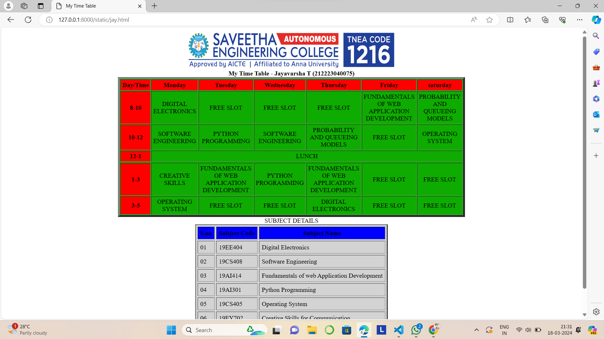
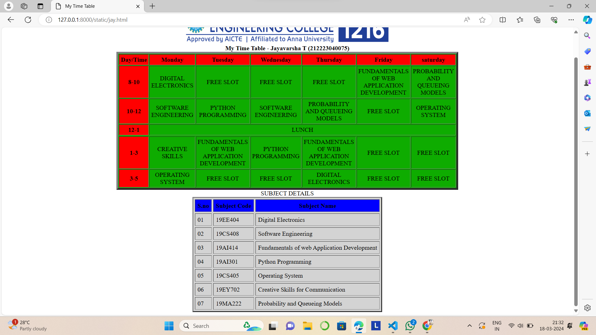

# Ex03 Time Table
## Date: 19.03.2024

## AIM
To write a html webpage page to display your slot timetable.

## ALGORITHM
### STEP 1
Create a Django-admin Interface.

### STEP 2
Create a static folder and inert HTML code.

### STEP 3
Create a simple table using ```<table>``` tag in html.

### STEP 4
Add header row using ```<th>``` tag.

### STEP 5
Add your timetable using ```<td>``` tag.

### STEP 6
Execute the program using runserver command.

## PROGRAM
```
<html>
<head>
<title>My Time Table</title>
</head>
<body>
<center>

</center>    
<table align="center" width="540" cellspacing="2" cellpadding="4" border="5" bgcolor="peach">
<caption><b>My Time Table - Jayavarsha T (212223040075)</b></caption>
<tr align="center">
<th bgcolor="red">Day/Time</th>
<th bgcolor="red">Monday</th>
<th bgcolor="red">Tuesday</th>
<th bgcolor="red">Wednesday</th>
<th bgcolor="red">Thursday</th>
<th bgcolor="red">Friday</th>
<th bgcolor="red">saturday</th>
</tr>    
<tr align="center">
<th bgcolor="red">8-10</th>
<td>DIGITAL ELECTRONICS</td>
<td>FREE SLOT</td>    
<td>FREE SLOT</td>
<td>FREE SLOT</td>
<td>FUNDAMENTALS OF WEB APPLICATION DEVELOPMENT</td>
<td>PROBABILITY AND QUEUEING MODELS</td>        
</tr>
<tr align="center">
<th bgcolor="red">10-12</th>
<td>SOFTWARE ENGINEERING</td>
<td>PYTHON PROGRAMMING</td>
<td>SOFTWARE ENGINEERING</td>
<td>PROBABILITY AND QUEUEING MODELS</td>
<td>FREE SLOT</td>
<td>OPERATING SYSTEM</td>
</tr>
<tr align="center">
<th bgcolor="red">12-1</th>
<td colspan="6">LUNCH</td>
</tr>
<tr>
<tr align="center">
<th bgcolor="red">1-3</th>
<td>CREATIVE SKILLS</td> 
<td>FUNDAMENTALS OF WEB APPLICATION DEVELOPMENT</td>
<td>PYTHON PROGRAMMING</td>
<td>FUNDAMENTALS OF WEB APPLICATION DEVELOPMENT</td>
<td>FREE SLOT</td> 
<td>FREE SLOT</td>       
</tr>
<tr align="center">
<th bgcolor="red">3-5</th>
<td>OPERATING SYSTEM</td>
<td>FREE SLOT</td>
<td>FREE SLOT</td>
<td>DIGITAL ELECTRONICS</td>
<td>FREE SLOT</td>
<td>FREE SLOT</td>
</tr>     
<table border="3" cellspacing="4" cellpadding="6" align="center" bgcolor="lightgrey">
<caption>SUBJECT DETAILS</caption>
<tr>
<th bgcolor="blue">S.no</th>
<th bgcolor="blue">Subject Code</th>
<th bgcolor="blue">Subject Name</th>
</tr>
<tr>
<td>01</td>
<td>19EE404</td>
<td>Digital Electronics</td>
</tr>
<tr>
<td>02</td>
<td>19CS408</td>
<td>Software Engineering</td>
</tr> 
<tr>
<td>03</td>
<td>19AI414</td>
<td>Fundamentals of web Application Development</td>
</tr>
<tr>
<td>04</td>
<td>19AI301</td>
<td>Python Programming</td>
</tr>
<tr>
<td>05</td>
<td>19CS405</td>
<td>Operating System</td>
</tr>
<tr>
<td>06</td>
<td>19EY702</td>
<td>Creative Skills for Communication</td>
</tr>
<tr>
<td>07</td>
<td>19MA222</td>
<td>Probability and Queueing Models</td>
</tr>
</body>
</html>
```
## OUTPUT



## RESULT
The program for creating slot timetable using basic HTML tags is executed successfully.
